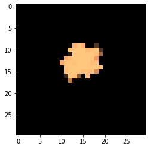

# Growth of a branching colony

This is the exact same as the circular colony protocol notebook, except that a few parameters in the COMETS model have been changed to cause the colony to branch.


```python
import cobra
import cobra.test # for the ijo1366 model
import sys
import numpy as np
sys.path.append("/home/jeremy/Dropbox/work_related/harcombe_lab/segre/cometspy")
import cometspy as c
```

First, let's make a "toy" model, using functionality of cobrapy. It directly converts extracellular carbon to biomass. 


```python
carbon = cobra.Metabolite("carbon",
                           compartment = "e")
carbon_exch = cobra.Reaction("Carbon_exch",
                            lower_bound = -1.,
                            upper_bound = 1000.)
carbon_exch.add_metabolites({carbon: -1.})
Biomass = cobra.Reaction("Biomass",
                        lower_bound = 0.,
                        upper_bound = 1000.)
Biomass.add_metabolites({carbon: -1.})
toy = cobra.Model("toy")
toy.add_reactions([carbon_exch, Biomass])
toy.objective = "Biomass"
toy.repair()
```

We can test that the model runs by doing FBA in cobrapy. It should generate as much biomass as the lower bound on carbon_exch.


```python
print(toy.medium)
print(toy.optimize().objective_value)
```

    {'Carbon_exch': 1.0}
    1.0


We will now convert this into a COMETS model, set its initial biomass, and set the first set of convection parameters. These are the parameters needed to obtain a branching colony with this toy model. Note that the timestep has to be set very low for this form of biomass spread.


```python
grid_size = 30

toy_comets = c.model(toy)
toy_comets.initial_pop = [int(grid_size / 2),int(grid_size / 2),1.0]
toy_comets.open_exchanges()
toy_comets.add_convection_parameters(packedDensity = 1.2,
                                    elasticModulus = 5.e-3,
                                    frictionConstant = 1.0,
                                    convDiffConstant = 0.0)
toy_comets.add_noise_variance_parameter(20.)
```

    Note: for convection parameters to function,
    params.all_params['biomassMotionStyle'] = 'Convection 2D'
    must also be set


We make sure that the COMETS model does not consider the biomass reaction an exchange.


```python
toy_comets.reactions.loc[toy_comets.reactions.REACTION_NAMES == "Biomass","EXCH"] = False
toy_comets.reactions.loc[toy_comets.reactions.REACTION_NAMES == "Biomass","EXCH_IND"] = 0
toy_comets.reactions.loc[toy_comets.reactions.REACTION_NAMES == "Biomass", "LB"] = 0
```

This simulation's layout will be of a single, centered colony on a 100x100 grid. carbon will be spread homogenously.


```python
ly = c.layout([toy_comets])
ly.grid = [grid_size, grid_size]
ly.set_specific_metabolite("carbon", 1.)
```

The main parameter we need to set is biomassmotionstyle, which must be set to "Convection 2D".  Then, to capture the spatial information, we'll also log biomass (instead of just total biomass). Finally, we'll also adjust a handful of other parameters. These are stored in the dictionary all_params.


```python
p = c.params()

p.all_params["biomassMotionStyle"] = "Convection 2D"
p.all_params["writeBiomassLog"] = True
p.all_params["BiomassLogRate"] = 500
p.all_params["maxCycles"] = 20000
p.all_params["timeStep"] = 0.00025
p.all_params["spaceWidth"] = 1
p.all_params["maxSpaceBiomass"] = 10
p.all_params["minSpaceBiomass"] = 0.25e-10
p.all_params["allowCellOverlap"] = True
p.all_params["growthDiffRate"] = 0
p.all_params["flowDiffRate"] = 3e-9
p.all_params["exchangestyle"] = "Monod Style"
p.all_params["defaultKm"] = 0.01
p.all_params["defaultHill"] = 1
p.all_params["defaultVmax"] = 100

```

Now we make a simulation object and run it.  This can take awhile.


```python
sim = c.comets(ly, p)
# this should all be removable once the installer is made with dependencies in a predictable location
sim.set_classpath("concurrent", "/opt/colt/lib/concurrent.jar")
sim.set_classpath("colt", "/opt/colt/lib/colt.jar")
sim.set_classpath("lang3", "/opt/commons-lang3-3.9/commons-lang3-3.9.jar")
sim.set_classpath("jmatio","/opt/jmatio/lib/jmatio.jar")
sim.set_classpath("math3","/opt/commons-math3-3.6.1/commons-math3-3.6.1.jar")
sim.set_classpath("bin","/home/jeremy/Dropbox/work_related/harcombe_lab/segre/jars/comets_2.10.0.jar")
sim.set_classpath("gurobi","/opt/gurobi900/linux64/lib/gurobi.jar")
sim.set_classpath("jdistlib", "/opt/jdistlib-0.4.5-bin.jar")

sim.run(False) # use the argument delete_files = False to keep all COMETS-generated files

```

    Warning: java class libraries cannot be found
    These are the expected locations for dependencies:
    Dependency 			 expected path
    __________ 			 _____________
    gurobi			/opt/gurobi900/linux64/gurobi.jar
    junit			/Dropbox/work_related/harcombe_lab/segre/comets/bin/lib/junit/junit-4.12.jar
    hamcrest			/Dropbox/work_related/harcombe_lab/segre/comets/bin/lib/junit/hamcrest-core-1.3.jar
    jogl_all			/Dropbox/work_related/harcombe_lab/segre/comets/bin/lib/jogl/jogamp-all-platforms/jar/jogl-all.jar
    gluegen_rt			/Dropbox/work_related/harcombe_lab/segre/comets/bin/lib/jogl/jogamp-all-platforms/jar/gluegen-rt.jar
    gluegen			/Dropbox/work_related/harcombe_lab/segre/comets/bin/lib/jogl/jogamp-all-platforms/jar/gluegen.jar
    gluegen_rt_natives			/Dropbox/work_related/harcombe_lab/segre/comets/bin/lib/jogl/jogamp-all-platforms/jar/gluegen-rt-natives-linux-amd64.jar
    jogl_all_natives			/Dropbox/work_related/harcombe_lab/segre/comets/bin/lib/jogl/jogamp-all-platforms/jar/jogl-all-natives-linux-amd64.jar
    jmatio			/Dropbox/work_related/harcombe_lab/segre/comets/bin/lib/JMatIO/lib/jamtio.jar
    jmat			/Dropbox/work_related/harcombe_lab/segre/comets/bin/lib/JMatIO/JMatIO-041212/lib/jmatio.jar
    concurrent			/Dropbox/work_related/harcombe_lab/segre/comets/bin/lib/colt/lib/concurrent.jar
    colt			/Dropbox/work_related/harcombe_lab/segre/comets/bin/lib/colt/lib/colt.jar
    lang3			/Dropbox/work_related/harcombe_lab/segre/comets/bin/lib/commons-lang3-3.7/commons-lang3-3.7.jar
    math3			/Dropbox/work_related/harcombe_lab/segre/comets/bin/lib/commons-math3-3.6.1/commons-math3-3.6.1.jar
    bin			/Dropbox/work_related/harcombe_lab/segre/comets/bin/bin/comets_evo.jar
    
      You have two options to fix this problem:
    1.  set each class path correctly by doing:
        comets.set_classpath(libraryname, path)
        e.g.   comets.set_classpath('hamcrest', '/home/chaco001/comets/junit/hamcrest-core-1.3.jar')
    
        note that versions dont always have to exactly match, but you're on your own if they don't
    
    2.  fully define the classpath yourself by overwriting comets.JAVA_CLASSPATH
           look at the current comets.JAVA_CLASSPATH to see how this should look.
    
    Running COMETS simulation ...
    Done!


Now let's plot the results. Note how we specify the axes, otherwise "cycle", "x", and "y" will be assumed to be state variables. 

What we see is that both species survive, because the LCTStex_KO cross-feeds galactose from the galE_KO, which uses the glucose piece of lactose. The metabolites, as is typical in a chemostat, are in very low concentrations once equilibrium is reached.


```python
im = sim.get_biomass_image('toy', 1500)
from matplotlib import pyplot as plt
import matplotlib.colors, matplotlib.cm
my_cmap = matplotlib.cm.get_cmap("copper")
my_cmap.set_bad((0,0,0))
plt.imshow(im, norm = matplotlib.colors.LogNorm(), cmap = my_cmap)

```


    <matplotlib.image.AxesImage at 0x7f966a6b3630>





```python
big_image = np.zeros((grid_size * 8, grid_size * 5))
im_cycles = np.arange(p.all_params["BiomassLogRate"], p.all_params["maxCycles"] + p.all_params["BiomassLogRate"],
                      p.all_params["BiomassLogRate"])
for i, cycle in enumerate(im_cycles):
    big_image[(grid_size * int(i / 5)):(grid_size + grid_size * int(i / 5)),(grid_size * (i % 5)):(grid_size + grid_size * (i % 5))] = sim.get_biomass_image("toy", cycle)
    plt.imshow(big_image, norm = matplotlib.colors.LogNorm(), cmap = my_cmap)
```


```python

```
