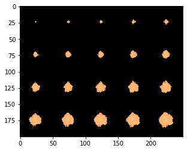

# Growth of a circular colony

This protocol replicates the main text protocol that simulates colony expansion via mechanical pushing among the growing cells. One of the characteristics of the implemented model is that it undergoes a transition in colony morphology depending on the value of the dense packing parameter. In this protocol, we will choose parameters that result in a round colony. In "branching_colony," we will choose parameters that result in a branching colony.

Additionally,we will show how to generate a simple metabolic model with a single nutrient and a single reaction of biomass growth from uptake of the nutrient.

We will make the layout much smaller than in the paper, however, because it is much faster to run.


```python
import cobra
import cobra.test # for the ijo1366 model
import sys
import numpy as np
import cometspy as c
```

First, let's make a "toy" model, using functionality of cobrapy. It directly converts extracellular carbon to biomass. 


```python
carbon = cobra.Metabolite("carbon",
                           compartment = "e")
carbon_exch = cobra.Reaction("Carbon_exch",
                            lower_bound = -1.,
                            upper_bound = 1000.)
carbon_exch.add_metabolites({carbon: -1.})
Biomass = cobra.Reaction("Biomass",
                        lower_bound = 0.,
                        upper_bound = 1000.)
Biomass.add_metabolites({carbon: -1.})
toy = cobra.Model("toy")
toy.add_reactions([carbon_exch, Biomass])
#toy.add_reactions([carbon_exch, carbon_transport, Biomass])
toy.objective = "Biomass"
toy.repair()
```

We can test that the model runs by doing FBA in cobrapy. It should generate as much biomass as the lower bound on carbon_exch.


```python
print(toy.medium)
print(toy.optimize().objective_value)
```

    {'Carbon_exch': 1.0}
    1.0


We will now convert this into a COMETS model, set its initial biomass, and set the first set of convection parameters. These are the parameters needed to obtain a circular colony with this toy model. Note that the timestep has to be set very low for this form of biomass spread.


```python
grid_size = 50

toy_comets = c.model(toy)
toy_comets.initial_pop = [int(grid_size / 2),int(grid_size / 2),1.0]
toy_comets.reactions.loc[toy_comets.reactions.EXCH, "LB"] = -1000
toy_comets.add_convection_parameters(packedDensity = 0.5,
                                    elasticModulus = 1.e-4,
                                    frictionConstant = 1.0,
                                    convDiffConstant = 0.0)
toy_comets.add_noise_variance_parameter(20.)
```

    Note: for convection parameters to function,
    params.all_params['biomassMotionStyle'] = 'Convection 2D'
    must also be set


We make sure that the COMETS model does not consider the biomass reaction an exchange.


```python
toy_comets.reactions.loc[toy_comets.reactions.REACTION_NAMES == "Biomass","EXCH"] = False
toy_comets.reactions.loc[toy_comets.reactions.REACTION_NAMES == "Biomass","EXCH_IND"] = 0
toy_comets.reactions.loc[toy_comets.reactions.REACTION_NAMES == "Biomass", "LB"] = 0
```

This simulation's layout will be of a single, centered colony on a 100x100 grid. carbon will be spread homogenously.


```python
ly = c.layout([toy_comets])
ly.grid = [grid_size, grid_size]
ly.set_specific_metabolite("carbon", 1.)
```

The main parameter we need to set is biomassmotionstyle, which must be set to "Convection 2D".  Then, to capture the spatial information, we'll also log biomass (instead of just total biomass). Finally, we'll also adjust a handful of other parameters. These are stored in the dictionary all_params.


```python
p = c.params()

p.set_param("biomassMotionStyle", "Convection 2D")
p.set_param("writeBiomassLog", True)
p.set_param("BiomassLogRate", 100)
p.set_param("maxCycles", 2000)
p.set_param("timeStep", 0.0005)
p.set_param("spaceWidth", 1)
p.set_param("maxSpaceBiomass", 10)
p.set_param("minSpaceBiomass", 0.25e-10)
p.set_param("allowCellOverlap", True)
p.set_param("growthDiffRate", 0)
p.set_param("flowDiffRate", 3e-9)
p.set_param("exchangestyle", "Monod Style")
p.set_param("defaultKm", 0.01)
p.set_param("defaultHill", 1)
p.set_param("defaultVmax", 100)

```

Now we make a simulation object and run it.  This can take awhile.


```python
sim = c.comets(ly, p)
sim.run() # set delete_files = False to maintain all comets-generated files
```

   
    Running COMETS simulation ...
    Done!


Now let's plot the results. we use the helper script "get_biomass_image," which needs the name of the model and the timestep. Then we use matplotlib to display it. 


```python
im = sim.get_biomass_image('toy', 2000)
from matplotlib import pyplot as plt
import matplotlib.colors, matplotlib.cm
my_cmap = matplotlib.cm.get_cmap("copper")
my_cmap.set_bad((0,0,0))
plt.imshow(im, norm = matplotlib.colors.LogNorm(), cmap = my_cmap)

```


We can tile the time series in a simple loop.


```python
big_image = np.zeros((grid_size * 4, grid_size * 5))
im_cycles = np.arange(p.all_params["BiomassLogRate"], p.all_params["maxCycles"] + p.all_params["BiomassLogRate"],
                      p.all_params["BiomassLogRate"])
for i, cycle in enumerate(im_cycles):
    big_image[(grid_size * int(i / 5)):(grid_size + grid_size * int(i / 5)),(grid_size * (i % 5)):(grid_size + grid_size * (i % 5))] = sim.get_biomass_image("toy", cycle)
```


```python
plt.imshow(big_image, norm = matplotlib.colors.LogNorm(), cmap = my_cmap)
```




```python

```
