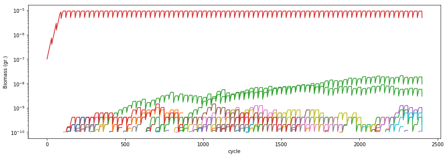

# Simulating evolution

`COMETS` is able to perform simulations that include the appearance of mutants containing reaction deletions and additions. In this small example, we will perform a serial transfer experiment starting with a clonal *Escherichia coli* population, and simulate the random appearance of reaction deletion mutants. We will then visualize the dynamics of all genotypes in time.

## Load the model
We start by importing the necessary libraries and loading the *E. coli* model. 


```python
import cometspy as c
import cobra.test
import os
import pandas as pd
import matplotlib.pyplot as plt

# load model 
wt = cobra.test.create_test_model("ecoli")
```

    Using license file /home/djordje/gurobi.lic
    Academic license - for non-commercial use only


Remove the bounds for all exchange reactions in the model to allow them to be controlled dynamically by `COMETS` 


```python
# Remove bounds from exchange reactions
for i in wt.reactions:
    if 'EX_' in i.id:
        i.lower_bound =-1000.0
```

## Set up the layout 
We create a well mixed environment with a glucose minimal media. Here, we use the custom `add_typical_trace_metabolites` method to add trace metabolites (ions, metals etc) in unlimited amounts (`static` flag).


```python
# generate layout
test_tube = c.layout()
test_tube.set_specific_metabolite('glc__D_e', 0.0001)
test_tube.add_typical_trace_metabolites(amount=1000)

# add model
wt = c.model(wt)
wt.initial_pop = [0, 0, 1e-7]
test_tube.add_model(wt)
```

    building empty layout model
    models will need to be added with layout.add_model()
    Warning: The added metabolite (glc__D_e) is notable to be taken up by any of the current models


## Set up simulation parameters
Create a params object, and modify the needed parameters. The simulation in this example simulation consists of 10 days of experiment, with a 1:2 transfer every 3h. The mutation rate will be $10^{-7}$ deletion events per reaction and generation. The `cellSize` parameter sets the amount of biomass that appears when a mutant occurs (i.e., one mutant cell appears).


```python
# .. load parameters and layout from file
evo_params = c.params()

evo_paramsset_param('timeStep', 0.1)             # hours

evo_paramsset_param('maxCycles', 2400)            # simulate 10 serial transfers of 24h each (timeStep = 0.1)
evo_paramsset_param('batchDilution', True)
evo_paramsset_param('dilFactor', 0.5)            # Dilution to apply
evo_paramsset_param('dilTime', 3)                # hours

evo_paramsset_param('evolution', True)
evo_paramsset_param('mutRate', 1e-8)             # 
evo_paramsset_param('cellSize', 1e-10)           # cellSize should always be larger than maxSpaceBiomass
evo_paramsset_param('minSpaceBiomass', 1e-11)    # make sure it is smaller than cell size!


evo_paramsset_param('BiomassLogRate', 1)
```

## Run the simulation
We now create the COMETS object using the above layout and parameters, and run the simulation. 


```python
# create comets object from the loaded parameters and layout 
evo_simulation = c.comets(test_tube, evo_params)
evo_simulation.JAVA_CLASSPATH = '/home/djordje/Dropbox/COMETS_RUN/lib/jmatio.jar:/home/djordje/Dropbox/COMETS_RUN/lib/jdistlib-0.4.5-bin.jar:/home/djordje/Dropbox/COMETS_RUN/lib/commons-math3-3.6.1.jar:/home/djordje/Dropbox/COMETS_RUN/lib/commons-lang3-3.9.jar:/home/djordje/Dropbox/COMETS_RUN/lib/colt.jar:/home/djordje/Dropbox/COMETS_RUN/lib/concurrent.jar:/home/djordje/Dropbox/COMETS_RUN/bin/comets_2.9.3.jar:/opt/gurobi901/linux64/lib/gurobi.jar'

# run comets simulation
evo_simulation.run()
```

    Warning: java class libraries cannot be found
    These are the expected locations for dependencies:
    Dependency 			 expected path
    __________ 			 _____________
    junit			/home/djordje/Dropbox/COMETS_RUN/lib/junit/junit-4.12.jar
    hamcrest			/home/djordje/Dropbox/COMETS_RUN/lib/junit/hamcrest-core-1.3.jar
    jogl_all			/home/djordje/Dropbox/COMETS_RUN/lib/jogl/jogamp-all-platforms/jar/jogl-all.jar
    gluegen_rt			/home/djordje/Dropbox/COMETS_RUN/lib/jogl/jogamp-all-platforms/jar/gluegen-rt.jar
    gluegen			/home/djordje/Dropbox/COMETS_RUN/lib/jogl/jogamp-all-platforms/jar/gluegen.jar
    gluegen_rt_natives			/home/djordje/Dropbox/COMETS_RUN/lib/jogl/jogamp-all-platforms/jar/gluegen-rt-natives-linux-amd64.jar
    jogl_all_natives			/home/djordje/Dropbox/COMETS_RUN/lib/jogl/jogamp-all-platforms/jar/jogl-all-natives-linux-amd64.jar
    jmatio			/home/djordje/Dropbox/COMETS_RUN/lib/JMatIO/lib/jamtio.jar
    jmat			/home/djordje/Dropbox/COMETS_RUN/lib/JMatIO/JMatIO-041212/lib/jmatio.jar
    concurrent			/home/djordje/Dropbox/COMETS_RUN/lib/colt/lib/concurrent.jar
    colt			/home/djordje/Dropbox/COMETS_RUN/lib/colt/lib/colt.jar
    lang3			/home/djordje/Dropbox/COMETS_RUN/lib/commons-lang3-3.7/commons-lang3-3.7.jar
    math3			/home/djordje/Dropbox/COMETS_RUN/lib/commons-math3-3.6.1/commons-math3-3.6.1.jar
    
      You have two options to fix this problem:
    1.  set each class path correctly by doing:
        comets.set_classpath(libraryname, path)
        e.g.   comets.set_classpath('hamcrest', '/home/chaco001/comets/junit/hamcrest-core-1.3.jar')
    
        note that versions dont always have to exactly match, but you're on your own if they don't
    
    2.  fully define the classpath yourself by overwriting comets.JAVA_CLASSPATH
           look at the current comets.JAVA_CLASSPATH to see how this should look.
    
    Running COMETS simulation ...
    Done!


## Visualize the results 
We can visualize the population dynamics of all species over time (color coded) using standard Python plotting tools.


```python
fig, ax = plt.subplots(figsize=(15, 5))

for key, grp in evo_simulation.biomass.groupby(['species']):
    ax = grp.plot(ax=ax, kind='line', x='cycle', y='biomass')
ax.get_legend().remove()
plt.yscale('log')
plt.ylabel("Biomass (gr.)")
```


    Text(0,0.5,'Biomass (gr.)')





In order to analyze the results, it is also helpful to visualize the genotypes data frame, which contains all the mutants that ever appeared during the simulation. The data frame contains three columns: The ancestor, the mutation, and the name of the resulting genotype, which is assigned as a random hash.


```python
evo_simulation.genotypes
```
