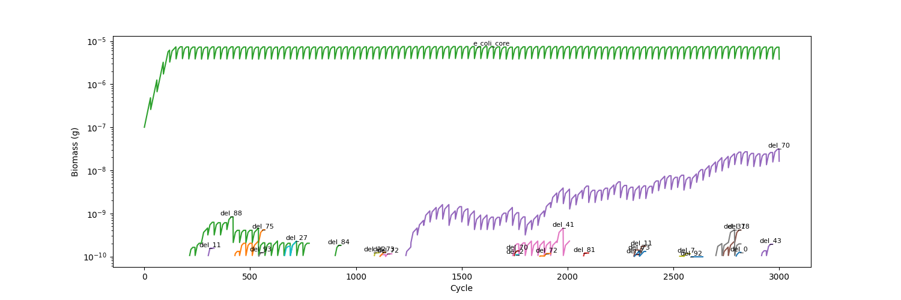

# Simulating evolution

`COMETS` is able to perform simulations that include the appearance of mutants containing reaction deletions and additions. In this small example, we will perform a serial transfer experiment starting with a clonal *Escherichia coli* population, and simulate the random appearance of reaction deletion mutants. We will then visualize the dynamics of all genotypes in time.

## Load the model
We start by importing the necessary libraries and loading the *E. coli* model. 


```python
import os
import cobra

import pandas as pd
import cometspy as c
import matplotlib.pyplot as plt

# load model 
model = cobra.io.load_model("e_coli_core")

```

    Using license file /home/djordje/gurobi.lic
    Academic license - for non-commercial use only


Remove the bounds for all exchange reactions in the model to allow them to be controlled dynamically by `COMETS` 


```python
# Remove bounds from exchange reactions
for i in model.reactions:
    if 'EX_' in i.id:
        i.lower_bound =-1000.0
```

## Set up the layout 
We create a well mixed environment with a glucose minimal media. Here, we use the custom `add_typical_trace_metabolites` method to add trace metabolites (ions, metals etc) in unlimited amounts (`static` flag).


```python
# generate layout
test_tube = c.layout()
test_tube.set_specific_metabolite('glc__D_e', 0.0001)
test_tube.add_typical_trace_metabolites(amount=1000)

# add model
wt = c.model(model)
wt.initial_pop = [0, 0, 1e-7]
test_tube.add_model(wt)
```

    building empty layout model
    models will need to be added with layout.add_model()
    Warning: The added metabolite (glc__D_e) is notable to be taken up by any of the current models


## Set up simulation parameters
Create a params object, and modify the needed parameters. The simulation in this example simulation consists of 10 days of experiment, with a 1:2 transfer every 3h. The mutation rate will be $10^{-7}$ deletion events per reaction and generation. The `cellSize` parameter sets the amount of biomass that appears when a mutant occurs (i.e., one mutant cell appears).


```python
# .. load parameters and layout from file
evo_params = c.params()

evo_params.set_param('timeStep', 0.1)             # hours

evo_params.set_param('maxCycles', 2400)            # simulate 10 serial transfers of 24h each (timeStep = 0.1)
evo_params.set_param('batchDilution', True)
evo_params.set_param('dilFactor', 0.5)            # Dilution to apply
evo_params.set_param('dilTime', 3)                # hours

evo_params.set_param('evolution', True)
evo_params.set_param('mutRate', 1e-8)             # 
evo_params.set_param('cellSize', 1e-10)           # cellSize should always be larger than maxSpaceBiomass
evo_params.set_param('minSpaceBiomass', 1e-11)    # make sure it is smaller than cell size!


evo_params.set_param('BiomassLogRate', 1)
```

## Run the simulation
We now create the COMETS object using the above layout and parameters, and run the simulation. 


```python
# create comets object from the loaded parameters and layout 
evo_simulation = c.comets(test_tube, evo_params)
```

In case a warning like 
`Warning: java class libraries cannot be found` is returned, you may consider to double check your `.bashrc`: 

```bash
# COMETS
export COMETS_HOME=/<path_to>/comets_linux/comets_2.12.5

# Python bindings
export PYTHONPATH=$COMETS_HOME/lib/cometspy-master:$PYTHONPATH

# Java classpath (CRITICAL FIX)
export COMETS_JAVA_CLASSPATH="$COMETS_HOME/lib/*:$COMETS_HOME/lib/or-tools/9.4.1874/*"

# Gurobi
export GUROBI_HOME=/opt/gurobi/linux64
export PATH=$PATH:$GUROBI_HOME/bin
export LD_LIBRARY_PATH=$LD_LIBRARY_PATH:$GUROBI_HOME/lib
```

Once `comets` is ready to go, you may run the simulation:

```python
# run comets simulation
evo_simulation.run()
```

    Running COMETS simulation ...
    Done!


## Visualize the results 
We can visualize the population dynamics of all species over time (color coded) using standard Python plotting tools.


```python

fig, ax = plt.subplots(figsize=(15, 5))

species_to_mut = evo_simulation.genotypes.set_index("Species")["Mutation"].to_dict()

for species, grp in evo_simulation.biomass.groupby("species"):
    grp = grp.sort_values("cycle")
    grp = grp[grp["biomass"] > 0]
    ax.plot(grp["cycle"], grp["biomass"])
    # find peak point
    peak_idx = grp["biomass"].idxmax()
    peak = grp.loc[peak_idx]
    label = species_to_mut.get(species, species)
    ax.text(
        peak["cycle"],
        peak["biomass"],
        label,
        fontsize=8,
        ha="center",
        va="bottom"
    )

ax.set_yscale("log")
ax.set_ylabel("Biomass (g)")
ax.set_xlabel("Cycle")

plt.show()
```


    Text(0,0.5,'Biomass (g)')





In order to analyze the results, it is also helpful to visualize the genotypes data frame, which contains all the mutants that ever appeared during the simulation. 
The data frame contains three columns: The ancestor, the mutation, and the name of the resulting genotype, which is assigned as a random hash.

```python
evo_simulation.genotypes.head()
```
    
              Ancestor Mutation                               Species
    0      NO_ANCESTOR   NO_MUT                       e_coli_core.cmd
    1  e_coli_core.cmd   del_88  1a10c078-ca36-4145-b956-53006511ba98
    2  e_coli_core.cmd   del_11  2b1fc102-808f-43df-86b0-d967fc66decf
    3  e_coli_core.cmd   del_75  12f368aa-3afc-4e50-9b3f-0901c6f0d713
    4  e_coli_core.cmd   del_93  47a5ccf6-f7b7-452a-a802-d656e995d46f

