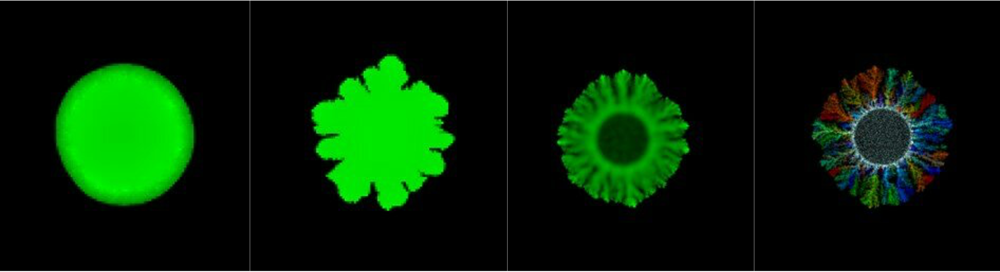
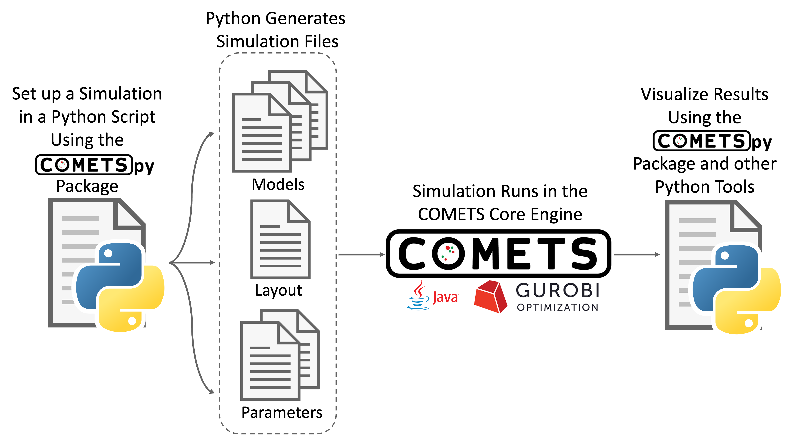

Introduction
============

What is COMETSpy?
----------------------------
COMETS is a software platform for performing **computer simulations of
metabolism in spatially structured microbial communities**. It is based on
stoichiometric modeling of the genome-scale metabolic network of
individual microbial species (using dynamic flux balance analysis), and
on a discrete approximation of convection-diffusion equations.

.. Images from COMETS simulations here, i.e. colony morpologies

COMETSpy is a Python package that provides a user-friendly interface to
COMETS. It allows users to easily set up and run simulations, and to
analyze the results. COMETSpy is designed to be used in conjunction with
COMETS. It is not a standalone package, and requires COMETS to be
installed on the user's computer.

.. Graphic showing the relationship between COMETS and COMETSpy

How to use this Documentation:
------------------------------

This documentation is meant to aide users in installing COMETSpy and
using COMETSpy to run simulations and analyze the results. If you need
help and do not easily find an answer in this documentation, ask your question
in a `new issue on GitHub <https://github.com/segrelab/cometspy/issues/new>`_.
**Any question that you have likely indicates a shortcoming in the documentation,
which we will want to fix!**

Find the module/class/function that you are interested in using in the
table of contents on the left or in the following indices, click on the link to
go to the appropriate documentation:

* :ref:`modindex`
* :ref:`genindex`

For a class, the documentation will include a brief description of the class,
the parameters that the class takes, and a list of all attributes, and examples
of how to use the class. The documentation will also include a list of all
the methods that are available for that class.

For a function, including the methods for a class, the documentation will 
include a description of what the function does, a list of the parameters that
the function takes and the objects that the function returns, and examples of
how to use the function.

Cite Us:
--------

The newest version of COMETS, which was developed as a partnership between
researchers at `Boston University <https://www.bu.edu/segrelab/>`_,
`Yale University <https://eeb.yale.edu/people/alvaro-sanchez>`_ and the
`University of Minnesota <http://www.wrharcombe.org/>`_ is fully described
in the following paper:

`Dukovski, Bajić, Chacón, Quintin, et al.: A metabolic modeling platform for
the computation of microbial ecosystems in time and space (COMETS), Nature
Protocols (2021) https://doi.org/10.1038/s41596-021-00593-3.
<https://www.nature.com/articles/s41596-021-00593-3>`_
